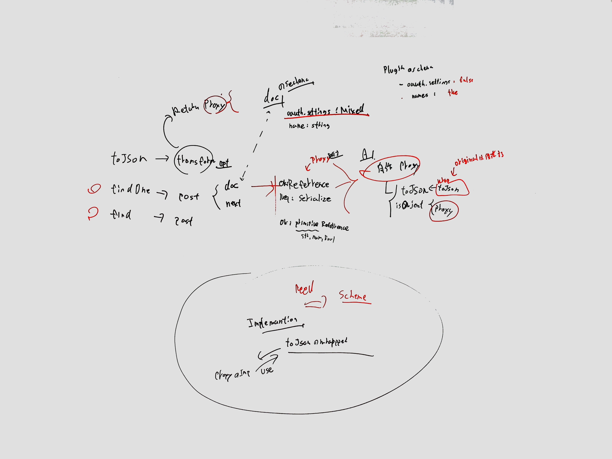

# Design Note



## Cover

- `Schema#toJSON`'s `transform` option
- `Schema#post`

### `Schema#toJSON` hook

**Does Cover**

- Stringify a document object

**Does not Cover**

- Assignment document's prop to variable and Stringify the variable

```js
(async function(){
    const UserSchema = new mongoose.Schema({
        name: String,
        email: String,
        password: String,
        secretSettings: Schema.Types.Mixed
    });
    // transform options
    UserSchema.set("toJSON", {
        transform: (_doc, ret, _options) => {
            console.log("transform");
            return ret;
        }
    });
    const User = mongoose.model("User", UserSchema);
    const user = await User.findOne();
    // Work "toJSON" transform option
    console.log(JSON.stringify(user));
    // Not Work "toJSON" transform option
    const secretSettings = user.secretSettings;
    console.log(JSON.stringify(secretSettings));
});
```

### `Schema#post` hook

**Do**

- Replace document's property with proxied property
    - The proxy filter sensitive value when stringify by `JSON.strinigdfy` 

Mongoose use [kareem](https://github.com/vkarpov15/kareem).

[kareem](https://github.com/vkarpov15/kareem) does not support to replace the object-self.
It only support modify object's property

```js
// OK
schema.post("findOne", function(doc) {
    doc.mod = "modified"
});
// Not work
schema.post("findOne", function(doc) {
    return {
        ...doc,
        mod: "modified"
    };
});
// Not work
schema.post("findOne", function(doc, next) {
    next(null, {
        ...doc,
        mod: "modified"
    });
});
```

## Implementations

- Object to Proxy Object
